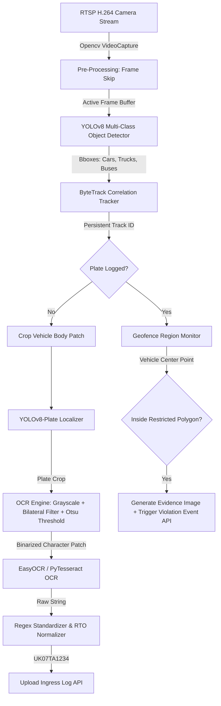

# SPEMS - Edge AI & ANPR Module

This directory houses the localized edge intelligence systems designed to run on-site (e.g., NVIDIA Jetson Orin) to process CCTV video feeds, track vehicles, check geographic parking zones, and perform Automatic Number Plate Recognition (ANPR).

---

## 1. Modular Pipeline Architecture



---

## 2. Dataset Requirements (Indian License Plates)

To achieve high recognition rates (>98%) on pilgrimage routes, a custom-trained model is deployed for license plate bounding box localization. 

### Recommended Dataset Composition:
1. **Source Volume**: Minimum 15,000 annotated vehicle images captured across Indian highways.
2. **Environmental Profiles**:
   - 40% Day / Sunny conditions.
   - 30% Night / Low illumination (requires infrared camera frames).
   - 20% Fog / Monsoon rain (common in Himalayan passes like Joshimath/Rudraprayag).
   - 10% High angles or occlusion (drones and overhead highway gantries).
3. **Annotation Format**: YOLO standard txt format. Each image `image_001.jpg` has a matching `image_001.txt` file containing:
   `[class_id] [x_center] [y_center] [width] [height]` (normalized values 0.0 to 1.0).

---

## 3. Custom YOLO Model Training Code

The following script trains a custom YOLOv8-plate model on the annotated dataset. Place this in your training environment (e.g., Google Colab or localized GPU server).

```python
# train_plate_detector.py
import os
from ultralytics import YOLO

def train_custom_anpr():
    # 1. Initialize a baseline pre-trained YOLOv8-nano model for plate detection
    model = YOLO("yolov8n.pt") 

    # 2. Define custom training arguments
    # dataset.yaml contains training paths and class definitions:
    # names:
    #   0: license_plate
    model.train(
        data="dataset.yaml",    # Configuration path for training/validation files
        epochs=100,             # Number of training epochs
        imgsz=640,              # Input image resolution size
        batch=16,               # Batch size (adjust based on GPU VRAM)
        device=0,               # GPU ID (use 'cpu' if no CUDA GPU is active)
        workers=8,              # Multi-threaded data loading worker count
        lr0=0.01,               # Initial learning rate parameter
        optimizer="AdamW",      # Optimizer matching custom character patterns
        project="spems_anpr",   # Output directory project name
        name="yolov8_plates"    # Target weights sub-directory
    )

    # 3. Export to highly optimized formats for Edge deployment
    print("Training complete. Exporting weights to TensorRT Engine format...")
    # TensorRT converts the model weights to native CUDA execution units on NVIDIA Jetson Orin
    model.export(format="engine", half=True) 

if __name__ == "__main__":
    train_custom_anpr()
```

---

## 4. Edge Hardware Deployment Guide

Follow these steps to deploy the edge supervisor on a physical NVIDIA Jetson Orin edge unit:

### 1. Prerequisite Installations (JetPack SDK)
Make sure the Jetson is flashed with JetPack 5.1+ containing CUDA 11.4+ and TensorRT support.

### 2. Core Dependencies
Install system libraries required for OpenCV and YOLO inference:
```bash
sudo apt-get update
sudo apt-get install -y python3-pip python3-opencv libjpeg-dev zlib1g-dev tesseract-ocr
```

### 3. Setup Python Virtual Environment
Initialize and install required dependencies:
```bash
python3 -m venv venv
source venv/bin/activate
pip install --upgrade pip
pip install -r requirements.txt
```

### 4. Hardware Acceleration (Optional but Recommended)
To run real-time inference on 4+ concurrent cameras using Jetson's GPU cores, export your PyTorch models to TensorRT:
```bash
# Exports the general tracker model to engine format on the edge hardware
yolo export model=models/yolov8n.pt format=engine device=0 half=True
```
Update `config.yaml` to point `yolo_model_path` to the exported `.engine` file.

### 5. Running the Service
Execute the master edge program:
```bash
python main_edge.py
```
To run as a system service that starts automatically on boot:
```bash
sudo cp spems-edge.service /etc/systemd/system/
sudo systemctl enable spems-edge.service
sudo systemctl start spems-edge.service
```
*(The systemd template file can be generated matching localized folder paths).*
